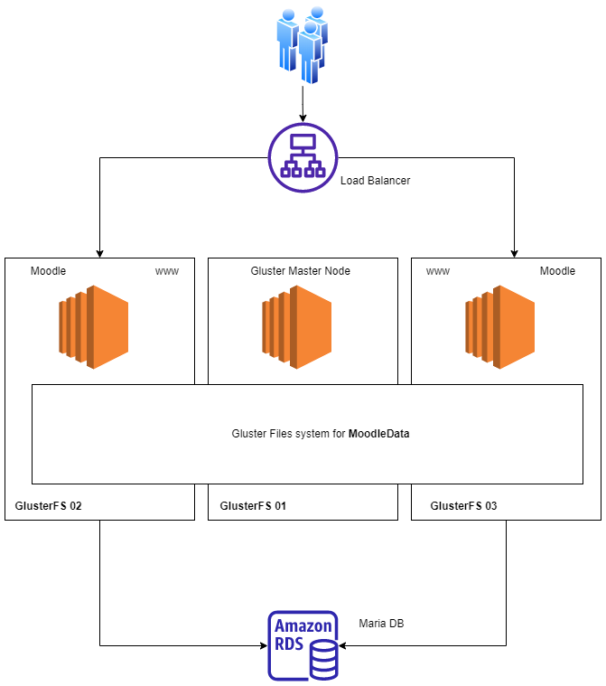

#  GFS-Moo (LAMP+GlusterFS+Moodle on Debian)
  ** This repo is under development 

<h2 align="right">

[](https://link.anuvindh.com/twitter/GFS-Moo-Github-tweet.html )


</h2>


<h2 align="center">


       

</h2>

## GlusterFS for Moodle

 Redundant Storage Pool Using GlusterFS on Debian Servers for moodle

### Architecture
<h2 align="center">


</h2>


## Prerequisites 

Launch three ubuntu based EC2/VM (EIP recommended for production) & security groups with ports open as shown below. 
### Security Groups
**Security Group** For GFS
|  Type | Protocol  | Ports  | Source |Description   |
| :------------: | :------------: | :------------: | :------------: |:------------: |
| SSH| SSH   | 22  | Administration Host Security Group   |Administration Host Security Group |
|  Custom TCP Rule  |  TCP | 2007  |  GlusterFS Security Group Secure Transport Server Security Group  | Gluster Daemon |
|  Custom TCP Rule  |TCP   | 111  | GlusterFS Security Group SecureTransport Server Security Group   | Portmapper |
| Custom TCP Rule   |TCP   | 49152-49251   |  GlusterFS Security Group SecureTransport Server Security Group  |Each brick for every volume on your host requires its own port  |
| Custom TCP Rule   | TCP  |  2049  | GlusterFS Security Group SecureTransport Server Security Group    | NFS |

**Security Group** For Moodle (LAMP)
|  Type | Protocol  | Ports  | Source |Description   |
| :------------: | :------------: | :------------: | :------------: |:------------: |
| HTTP |TCP | 80 | Users | For HTTP traffic|
|HTTPS |TCP| 443 | Users | For HTTPS traffic |

</br>

### EC2 

Here is **AWS CLI script** if you want to launch through CLI or use AWS Console 

```bash
 aws ec2 run-instances \ 
   --image-id ami-xxxxxxxxxxxxxx\ 
    --count 3 \ 
    --instance-type xx.xxxx \ 
    --key-name YourKey \ 
    --security-group-ids sg-xxxxxxxxxxxx \ 
    --subnet-id subnet-xxxxxxx \ 
    --associate-public-ip-address \ 
    --tag-specifications 'ResourceType=instance,Tags=[{Key=Name,Value=GlusterFS -}]' 
```
    
</br>

Use Putty to SSH into all three Servers, [Configure putty](https://docs.aws.amazon.com/AWSEC2/latest/UserGuide/putty.html)
If you want to use muti-SSH try [mRemoteNG](https://mremoteng.org/) 
Also Note down the Public IP for all three servers, for the easy of understanding 

Let's Re-name  Servers on Console

|  Server   | Rename to   | Public IP   |
| :------------: | :------------: | :------------: |
|Server 1    | GlusterFS-01  |ip1 (use your server1 public IP) |
|Server 2 | GlusterFS-02  |ip2 (use your server2 public IP) |
|Server 3 | GlusterFS-03  |ip3 (use your server3 public IP) |

### Git
Make sure EC2/VM have git installed</br>
 To check 
 ```bash 
 git --version
 ```
 
 To install git </br>
 
  ```bash
  sudo apt install git-all
  ```


## Tutorial

#### Blog
#### Youtube

## Basic Installation

SSH into Servers orderly and run commands


Get root privilages to run command 
```bash
sudo su -
```

|  Stage | On Server | Command   |
| :------------: | :------------: |:------------ |
|  1 | **GlusterFS-03** |`wget https://raw.githubusercontent.com/anuvindhs/GFS-Moo/main/install.sh ` </br> `chmod u+x install.sh ` </br> `./install.sh`|
|  2 |**GlusterFS-02** |`wget https://raw.githubusercontent.com/anuvindhs/GFS-Moo/main/install.sh ` </br> `chmod u+x install.sh ` </br> `./install.sh`|
| 3 | **GlusterFS-01** |`wget https://raw.githubusercontent.com/anuvindhs/GFS-Moo/main/install.sh ` </br> `chmod u+x install.sh ` </br> `./install.sh`|

[Inspect install.sh Code](https://github.com/anuvindhs/GFS-Moo/blob/main/install.sh) 

#### Mount Folder

```bash
sudo mount -t glusterfs gfs-moo-01:/gv0 /var/www/moodledata
```

## License

Released under the [MIT license](LICENSE.txt).

